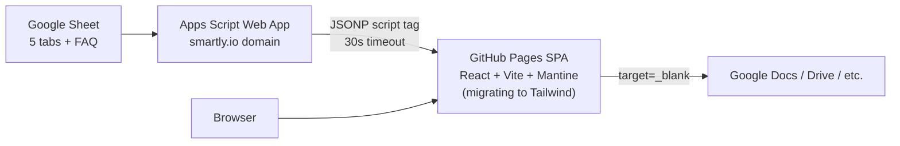
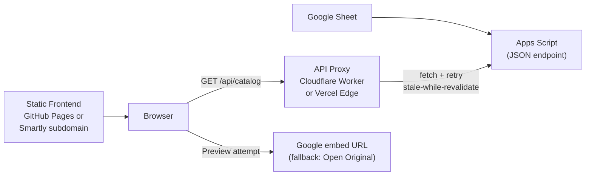
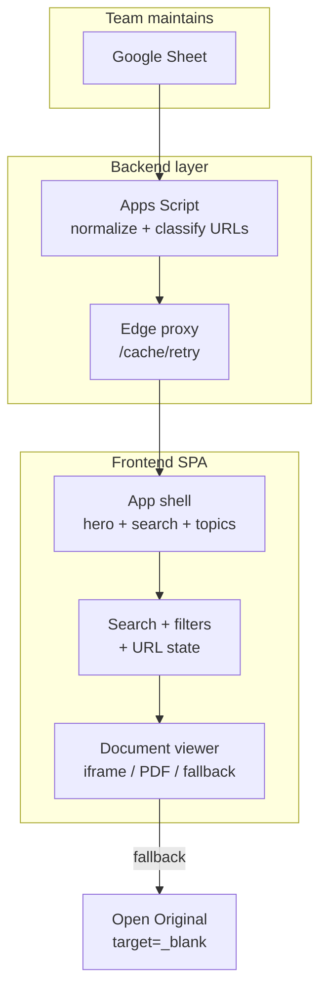

# H5 Team Knowledge Base — Development Plan

This is the working copy of the redesign plan. Cursor also stores a copy at `~/.cursor/plans/h5_kb_redesign_plan_9a5f5d5c.plan.md` (not inside this repo).

## Current State Summary (Audit Findings)

**Important:** The workspace `[/Users/romelordinario/Documents/2026/h5-knowledgebase](/Users/romelordinario/Documents/2026/h5-knowledgebase)` is empty. The live codebase is at `[/Users/romelordinario/Documents/2026/internal site/](/Users/romelordinario/Documents/2026/internal site/)` (GitHub: `romelordinarioGithub/h5-knowledgebase-site`).

### Architecture Today




| Layer              | Current implementation                                                                                                                                            | Pain points                                                     |
| ------------------ | ----------------------------------------------------------------------------------------------------------------------------------------------------------------- | --------------------------------------------------------------- |
| **Data source**    | Google Sheet `1yfK2W_6Te_tDCl8pxFo1FGTOIsqzp-nvw-fk0foW8zA` with 5 content tabs + FAQ                                                                             | Team-friendly; keep this                                        |
| **Backend**        | `[apps-script-backup/Code.gs](/Users/romelordinario/Documents/2026/internal site/apps-script-backup/Code.gs)` — reads sheets, normalizes rows, 120s server cache  | Cold starts + FAQ Sheets API call can exceed 30s client timeout |
| **Frontend fetch** | `[mantine-app/src/App.jsx](/Users/romelordinario/Documents/2026/internal site/mantine-app/src/App.jsx)` — JSONP via dynamic `<script>` tag, 30s timeout, no retry | Exact error: "Apps Script JSONP request timed out"              |
| **Frontend UI**    | Single 523-line `App.jsx` + 800-line `index.css`                                                                                                                  | Monolithic, no routing, no client cache                         |
| **Links**          | Card click → detail modal; "Read More" / "Open Document" → `target="_blank"`                                                                                      | No in-app consumption                                           |
| **Deploy**         | Manual `npm run deploy` → `gh-pages` branch; `base: '/h5-knowledgebase-site/'`                                                                                    | No CI/CD                                                        |
| **Config**         | Hardcoded URLs and GIDs in both frontend and backend                                                                                                              | Duplicated, error-prone                                         |


### Spreadsheet Schema (per tab)

- **Row 1:** Headers (flexible matching in Apps Script via `pickFirst()`)
- **Title column:** Tab-specific (`Delivery Type`, `Template Name`, `Studio Setup Type`, `Process Doc`, `Tool Name`)
- **URL column:** `Doc Guide`, `Url Links`, `Links`, or `Link`
- **Metadata:** `Last Update`, `Author(s)`, `tags` (comma-separated)
- **Normalized row shape:** `{ id, sourceSheet, title, url, lastUpdate, lastUpdateStamp, authors, tags[] }`

### Document Preview — Technical Reality

Preview **cannot** be assumed for all link types. Constraints:


| Provider / type                        | iframe embed on external origin (e.g. github.io)             | Notes                                                                                                                 |
| -------------------------------------- | ------------------------------------------------------------ | --------------------------------------------------------------------------------------------------------------------- |
| **Google Slides** (domain-restricted)  | Unreliable                                                   | `/embed` or `/preview` may show login prompt inside iframe or be blocked by `X-Frame-Options` / CSP `frame-ancestors` |
| **Google Docs / Sheets**               | Same as Slides                                               | Private/domain docs require auth; cross-origin iframe often fails                                                     |
| **Google Drive PDF**                   | Sometimes works with `/preview` if user has access + cookies | Still may block framing                                                                                               |
| **SharePoint / OneDrive / PowerPoint** | **Blocked** on non-Microsoft domains                         | Microsoft CSP `frame-ancestors` whitelist excludes custom domains                                                     |
| **Making docs public**                 | Would enable embed                                           | **Rejected** — must not expose internal docs                                                                          |


**Recommended preview strategy (capability-based, not assumption-based):**

1. **Classify URL** at ingest time (Apps Script or frontend): `google_slides`, `google_doc`, `google_sheet`, `google_drive_file`, `sharepoint`, `external`, `unknown`
2. **Attempt preview** only for types with known embed patterns (Slides/Docs `/embed`, Drive PDF `/preview`)
3. **Detect failure** via iframe `onLoad` heuristics + timeout (blank frame, login redirect, CSP console errors) → show **"Open Original"** CTA
4. **Optional enhancement (Phase 5):** Server-side export (Apps Script or proxy) of Slides/PPT → PDF for users who already have sheet access — renders via PDF.js without changing doc permissions
5. **Never** require "Anyone with the link" sharing

### Hosting Recommendation (you selected "unsure")

**Recommended target architecture:**




**Why this over JSONP-only or full rewrite:**

- Keeps Google Sheet workflow unchanged
- Eliminates JSONP (use `fetch()` server-side in proxy — no CORS issues)
- Adds retry, longer timeout, edge caching, stale-while-revalidate
- Frontend stays static (cheap, simple deploy)
- Cloudflare Workers free tier is sufficient for an internal catalog

**Long-term:** Move frontend to a Smartly subdomain (e.g. `kb.smartly.io`) for internal branding; proxy URL stays the same. Not required for Phase 2.

---

## Target Architecture




**Tech stack (target):** React 19 + Vite + **Tailwind CSS v4**, add React Router, TypeScript (incremental), optional TanStack Query for data fetching.

**UI component strategy (replacing Mantine):**
- **Tailwind CSS** for all styling (utility-first, design tokens via `@theme`)
- **Headless UI** or **Radix UI** for accessible primitives (Dialog/Modal, Listbox/Select, Combobox) — lightweight, no opinionated visual layer
- **Sonner** or custom toast component for notifications (replaces `@mantine/notifications`)
- **Montserrat** font retained via `@fontsource/montserrat` or Google Fonts
- Existing custom CSS (`index.css` hero, cards, gradients) ported to Tailwind `@layer components` where appropriate

**New repo layout** (after Phase 0 migration):

```
h5-knowledgebase/
├── apps/
│   └── web/                  # React frontend (migrated from mantine-app, rebuilt with Tailwind)
├── packages/
│   └── shared/               # Types, URL classifier, constants
├── services/
│   ├── apps-script/          # Code.gs (from apps-script-backup)
│   └── api-proxy/            # Cloudflare Worker or Vercel function
├── docs/
│   └── DEVELOPMENT_PLAN.md   # This plan
├── .github/workflows/        # CI: lint, build, deploy
└── README.md
```

---

## Phase 0 — Audit, Baseline, and Repo Migration

### Goal

Establish a reproducible baseline in `h5-knowledgebase`, document current behavior, and capture acceptance metrics before changing architecture.

### Scope

- Clone `romelordinarioGithub/h5-knowledgebase-site` into `[h5-knowledgebase](/Users/romelordinario/Documents/2026/h5-knowledgebase)`
- Inventory all spreadsheet tabs, row counts, URL domains (docs.google.com, drive.google.com, sharepoint, etc.)
- Record current load times (cold vs warm), timeout frequency, bundle size
- Document Apps Script deployment settings and sheet GIDs
- Capture screenshots of current UI as design reference
- Create `docs/AUDIT.md` with findings and link-type distribution

### Technical considerations

- Do not change production deploy during audit
- Run local dev against live Apps Script endpoint to reproduce timeout
- Export a sample JSON payload from Apps Script for fixture tests later

### Acceptance criteria

- [ ] Repo cloned and runs locally (`npm install && npm run dev`)
- [ ] `docs/AUDIT.md` complete with architecture diagram, pain points, URL taxonomy sample
- [ ] Baseline metrics recorded (TTI, JSONP success rate over 10 requests, bundle size)
- [ ] Git remote configured; branch strategy documented (`main` + feature branches)

### Standalone Cursor Prompt — Phase 0

```
Phase 0: Audit, Baseline, and Repo Migration for H5 Team Knowledge Base

Context: The current Knowledge Base lives at /Users/romelordinario/Documents/2026/internal site/ (GitHub: romelordinarioGithub/h5-knowledgebase-site). The target workspace /Users/romelordinario/Documents/2026/h5-knowledgebase is empty and should become the new working repo.

Tasks:
1. Clone or copy the existing repo into h5-knowledgebase. Preserve git history if possible.
2. Run the app locally and verify it loads data from the Apps Script endpoint.
3. Read and document: App.jsx (JSONP fetch), Code.gs (sheet normalization), vite.config.js, package.json, deployment setup.
4. Create docs/AUDIT.md covering:
   - Current architecture and data flow
   - Spreadsheet schema (tabs, columns, normalized row shape)
   - Known issues (JSONP timeout, new-tab links, monolithic App.jsx, no CI)
   - URL/link type inventory (sample 20+ doc URLs classified by provider)
   - Baseline performance metrics
   - Design reference notes from existing purple hero UI
   - Mantine component inventory (Modal, Select, TextInput, Button, Notifications) to map to Tailwind replacements in Phase 2
5. Do NOT change architecture yet. Do NOT deploy.

Acceptance: Local dev works, docs/AUDIT.md is complete, repo is ready for Phase 1.
```

---

## Phase 1 — Architecture and Data Reliability

### Goal

Replace JSONP with a reliable, cached API layer while keeping Google Sheets + Apps Script as the editorial source of truth.

### Scope

- Restructure repo (`apps/web`, `services/apps-script`, `services/api-proxy`, `packages/shared`)
- Extend Apps Script payload: add `linkType`, `embedUrl`, `canPreview` (heuristic), `provider`
- Build edge proxy (Cloudflare Worker recommended):
  - `GET /api/catalog` → fetch Apps Script JSON (not JSONP)
  - Retry 2–3x with exponential backoff
  - Edge cache TTL 5 min; `stale-while-revalidate` header
  - Return `{ data, cachedAt, stale }` envelope
- Frontend data layer refactor:
  - Extract fetch logic from `App.jsx` into `services/catalogApi.ts`
  - Add TanStack Query (or equivalent) with `staleTime`, retry, background refetch
  - **Client-side persistent cache** (localStorage/IndexedDB) for offline/stale fallback
  - Remove JSONP entirely
- Environment config via `.env.example` (proxy URL, Apps Script URL for proxy only)
- Reduce Apps Script cold-start: defer FAQ rich-text API call or cache separately

### Technical considerations

- Proxy must authenticate to Apps Script: deploy as "Anyone in smartly.io" — proxy calls from server may need OAuth service account OR keep Apps Script as "Anyone" with obscured URL + rate limiting; **preferred:** Apps Script executed as deployer with "Anyone in domain" and proxy passes through user's cookie is NOT possible server-side → use **deploy as Me + domain-restricted** and have Worker use a shared secret header checked by Apps Script, OR publish catalog to static JSON on schedule
- **Pragmatic approach:** Apps Script `doGet` returns JSON; Worker fetches with API key query param validated in Apps Script; Worker is domain-restricted via Cloudflare Access (Smartly SSO) if available
- Keep `SOURCE_SHEETS` in one shared constants file synced to Apps Script manually (document sync process)
- Fallback: if proxy fails, serve last-known-good from client cache with banner "Showing cached data"

### Acceptance criteria

- [ ] No JSONP in codebase
- [ ] Initial load succeeds consistently (< 3s warm, < 8s cold) in 20 consecutive tests
- [ ] Timeout errors show actionable message + cached fallback when available
- [ ] Auto-refresh uses background fetch; failures don't wipe UI
- [ ] Apps Script + proxy documented in `docs/DATA_LAYER.md`

### Standalone Cursor Prompt — Phase 1

```
Phase 1: Architecture and Data Reliability for H5 Knowledge Base

Prerequisites: Phase 0 complete. Repo at h5-knowledgebase with docs/AUDIT.md.

Goal: Eliminate JSONP timeouts by introducing a cached API proxy while keeping Google Sheets as source of truth.

Implement:
1. Restructure repo:
   - apps/web/ (move mantine-app here)
   - services/apps-script/Code.gs
   - services/api-proxy/ (Cloudflare Worker)
   - packages/shared/ (types, SOURCE_SHEETS, URL classifier stubs)

2. Extend Apps Script payload per row:
   - linkType, provider, embedUrl (nullable), canPreview (boolean heuristic)
   Classify: google_slides, google_doc, google_sheet, google_drive, sharepoint, onedrive, external

3. Build Cloudflare Worker (or Vercel edge function):
   - GET /api/catalog fetches Apps Script JSON endpoint (NOT JSONP)
   - Retry with backoff, 60s server timeout
   - Cache at edge (5 min TTL, stale-while-revalidate)
   - Optional: validate X-API-Key header

4. Refactor frontend data fetching:
   - Remove fetchNormalizedRowsJSONP from App.jsx
   - Add catalogApi + TanStack Query (or similar)
   - Persist last successful payload to localStorage/IndexedDB
   - On error: show toast notification + render cached data with "Last updated X ago" banner
   - Reduce auto-sync from 60s to 5min OR only on visibility change + manual refresh

5. Add docs/DATA_LAYER.md and .env.example

Do NOT migrate Mantine → Tailwind yet (Phase 2). Do NOT implement document preview UI yet. Keep existing Mantine UI functional during Phase 1.

Acceptance: No JSONP; reliable loads; cached fallback works; all existing browse/search/filter behavior preserved.
```

---

## Phase 2 — Tailwind Migration, UI Refactor, Performance, and Design Polish

### Goal

Replace Mantine with Tailwind CSS, improve maintainability and perceived performance, and preserve the purple hero / topic cards / featured articles design language.

### Scope

- **Tailwind setup:**
  - Install and configure Tailwind CSS v4 with Vite plugin (`@tailwindcss/vite`)
  - Define design tokens in `tailwind.config` / `@theme`: primary purple (`#7a30d8`), surfaces, radii, shadows, Montserrat font
  - Remove all Mantine packages (`@mantine/core`, `@mantine/hooks`, `@mantine/notifications`, `@emotion/react`)
- **Component library replacements:**

| Mantine (current) | Tailwind replacement |
|---|---|
| `TextInput` | Native `<input>` + Tailwind classes |
| `Select` | Headless UI `Listbox` or Radix `Select` + Tailwind |
| `Button` | `<button>` + Tailwind variant classes (`btn-primary`, `btn-ghost`) |
| `Modal` | Headless UI `Dialog` or Radix `Dialog` + Tailwind overlay/panel |
| `Notifications` | Sonner toast library or lightweight custom `Toast` component |
| `MantineProvider` | Remove; no provider needed |

- Split monolithic `App.jsx` into components:
  - `HeroSearch`, `TopicCards`, `FeaturedArticles`, `FilterBar`, `ResultsGrid`, `ResultCard`, `DetailDrawer`, `FaqModal`, `ErrorBanner`, `LoadingShell`
  - Shared UI primitives in `components/ui/` (Button, Input, Select, Modal, Badge, Tag)
- Add React Router with routes:
  - `/` — home (search + topics + featured)
  - `/browse/:category?` — filtered browse
  - `/doc/:id` — document detail + preview shell (preview wired in Phase 4)
- Port existing custom CSS from `index.css` to Tailwind:
  - Hero gradient, circuit overlay → Tailwind `@layer components` or arbitrary values
  - Card/topic/featured styles → component classes
  - Delete redundant `index.css` rules once ported
- Performance:
  - Code-split routes and modals
  - Virtualize results list if > 100 items (`@tanstack/react-virtual`)
  - Optimize SVG/icons (inline → sprite or component)
  - Lighthouse target: Performance ≥ 90, Accessibility ≥ 90
  - Bundle target: smaller than Mantine baseline (expect ~100–150KB savings)
- Design improvements (keep aesthetic):
  - Refine hero gradient and spacing
  - Active state on topic cards when filtered
  - Skeleton loaders instead of full-page loader
  - Empty/error states with icons
  - Responsive polish (820px breakpoint → add tablet/desktop tiers)

### Technical considerations

- Incremental TypeScript migration for new components (`.tsx`); keep JS interop
- Headless UI / Radix handle focus trap and ARIA for modals and selects — do not reimplement from scratch
- Preserve exact color palette from current design (`--primary: #7a30d8`, hero gradient stops)
- Avoid scope creep into search/preview logic (Phases 3–4)
- Run visual comparison against screenshots before/after Mantine removal

### Acceptance criteria

- [x] Zero Mantine imports in codebase
- [x] Tailwind configured with design tokens matching current purple theme
- [x] No file > 250 lines except generated/types
- [x] Visual parity with current design + noticeable polish
- [x] Route transitions work; browser back/forward supported
- [ ] LCP < 2.5s on warm load (local throttled test)
- [x] All existing features work (search, filters, FAQ, featured, refresh, error toasts)
- [x] Accessible modals and selects (keyboard nav, focus trap) via headless primitives

### Standalone Cursor Prompt — Phase 2

```
Phase 2: Tailwind Migration, UI Refactor, Performance, and Design Polish

Prerequisites: Phase 1 complete. Data loads via proxy API with cached fallback.

Goal: Replace Mantine with Tailwind CSS, decompose monolithic App.jsx, add routing, and polish the UI while keeping the purple hero / topic cards / featured articles aesthetic.

Implement:
1. Install Tailwind CSS v4 (@tailwindcss/vite), Headless UI or Radix UI, and Sonner (or custom toast)
2. Remove all Mantine packages and MantineProvider from main.jsx
3. Create apps/web/src/components/ui/ primitives: Button, Input, Select, Modal, Badge, Tag — all styled with Tailwind
4. Map Mantine components to Tailwind equivalents:
   - TextInput → Input, Select → Headless Listbox, Button → Button, Modal → Headless Dialog, notifications → Sonner
5. Split App.jsx into focused components under apps/web/src/components/
6. Add React Router: /, /browse/:category?, /doc/:id
7. Port index.css styles (hero gradient, cards, topic cards, featured list, modals) to Tailwind @layer components; delete redundant CSS
8. Define @theme tokens: primary #7a30d8, surfaces, radii, shadows, Montserrat font
9. Replace full-page startup loader with Tailwind skeleton states
10. Add active/selected state to topic cards when Source Sheet filter matches
11. Code-split routes; virtualize results if needed
12. Polish responsive layout (mobile topic scroll, filter stacking, modal sizing)
13. Incremental TypeScript for new files

Do NOT implement preview iframe yet (Phase 4). Do NOT change search algorithm yet (Phase 3).

Acceptance: Zero Mantine deps; Tailwind UI matches/improves screenshots; routing works; accessible modals/selects; Lighthouse perf ≥ 90 locally.
```

---

## Phase 3 — Search and Link Experience

### Goal

Make search and navigation feel fast and intentional; stop forcing users out of the app by default.

### Scope

- Upgrade search:
  - Debounced input (200ms)
  - Search across title, tags, authors, sourceSheet, URL domain
  - Optional: lightweight fuzzy match (e.g. `match-sorter` or `fuse.js` — small bundle)
  - Highlight matched terms in result cards
  - Sync search + filters to URL query params (`?q=studio&sheet=Studio+Setup&sort=newest`)
- Link behavior changes:
  - **Primary action:** Open in-app detail/preview route (`/doc/:id`)
  - **Secondary action:** "Open Original" (explicit external, `target="_blank"`)
  - Remove `target="_blank"` from "Read More" on cards; rename to "View" or make whole card navigate in-app
- Featured articles:
  - Add optional `Featured` column in spreadsheet OR `featured` tag OR curated list in config
  - Fall back to current random selection if column absent
- Filter fixes:
  - Rename misleading "Doc Type" filter → "Document Title" or derive real type from `linkType`
  - Add filter by `linkType` (Slides, Doc, PDF, Tool link, etc.)
- Keyboard shortcuts: `/` focus search, `Esc` close modals

### Technical considerations

- URL state must round-trip on refresh and shareable links
- Preserve backward compatibility with existing sheet columns (Featured column optional)
- Update Apps Script to read optional `Featured` column and `linkType` filter metadata

### Acceptance criteria

- [x] Clicking a result opens in-app `/doc/:id` by default
- [x] Search is debounced with highlighted matches
- [x] Filter state reflected in URL and restorable on reload
- [x] "Open Original" clearly labeled with external-link icon
- [x] Featured articles configurable from sheet (with fallback)

### Standalone Cursor Prompt — Phase 3

```
Phase 3: Search and Link Experience

Prerequisites: Phase 2 complete with routing and componentized UI.

Goal: Improve search quality and change default link behavior to in-app viewing instead of new tabs.

Implement:
1. Debounced search with match highlighting across title, tags, authors, sourceSheet
2. Optional fuzzy search (fuse.js or match-sorter) — keep bundle impact minimal
3. URL query param sync for q, sheet, type, sort, linkType
4. Change result card primary action: navigate to /doc/:id (in-app)
5. Keep explicit "Open Original" button with target=_blank and external icon
6. Rename "Doc Type" filter; add linkType filter using Phase 1 classifier
7. Featured articles: support optional "Featured" column (Y/yes/1) in spreadsheet via Apps Script; fallback to random
8. Keyboard: / focuses search, Esc closes overlays

Do NOT build iframe preview logic yet — /doc/:id shows metadata + "Open Original" placeholder for preview panel.

Acceptance: Default in-app navigation works; shareable filtered URLs; improved search UX.
```

---

## Phase 4 — Document Preview (Capability-Aware)

### Goal

Preview Google Slides (and other supported types) in-app when technically possible; gracefully fall back otherwise.

### Scope

- Build `DocumentViewer` component with states: `loading`, `preview`, `auth_required`, `unsupported`, `error`
- URL → embed strategy map:


| linkType                          | embed attempt                                                              | fallback                  |
| --------------------------------- | -------------------------------------------------------------------------- | ------------------------- |
| `google_slides`                   | `https://docs.google.com/presentation/d/{id}/embed?start=false&loop=false` | Open Original             |
| `google_doc`                      | `https://docs.google.com/document/d/{id}/preview`                          | Open Original             |
| `google_sheet`                    | `https://docs.google.com/spreadsheets/d/{id}/preview`                      | Open Original             |
| `google_drive` (PDF)              | `https://drive.google.com/file/d/{id}/preview`                             | Open Original             |
| `sharepoint` / `onedrive` / `ppt` | **No iframe attempt**                                                      | Open Original immediately |
| `external`                        | **No iframe**                                                              | Open Original             |


- Preview failure detection:
  - iframes `sandbox` attribute: `allow-scripts allow-same-origin allow-popups`
  - 8s load timeout → fallback
  - Optional: attempt fetch HEAD to detect `X-Frame-Options: DENY` where CORS allows (often won't) — rely on timeout + user feedback
  - Show inline message: "Preview isn't available for this document. You may need to open it directly."
- `/doc/:id` layout: metadata sidebar + preview panel (responsive: stacked on mobile)
- **Do NOT** change document sharing settings
- Log preview success/failure rates (console or optional analytics hook) for tuning

### Optional sub-feature (if straightforward)

- Apps Script export endpoint: export Slides to PDF via `Drive.Files.export` for domain users → serve through proxy → render with PDF.js  
- Only for slides/ppt where iframe fails; requires service account or user-delegated export — document security implications in `docs/PREVIEW_LIMITATIONS.md`

### Technical considerations

- Smartly users logged into Google may get working Slides embed; others see auth prompt — treat auth prompt as failure after timeout
- Microsoft files: skip iframe entirely (CSP blocked)
- CSP on our app: allow iframe src to `https://docs.google.com`, `https://drive.google.com` only
- Sanitize all URLs; validate IDs with regex before building embed URLs

### Acceptance criteria

- [x] Slides from sheet open in preview panel for users with doc access (when Google allows)
- [x] SharePoint/PPT links show clear "Preview not supported" + Open Original (no blank iframe)
- [x] Preview failure never leaves user stuck — fallback within 8s
- [x] `docs/PREVIEW_LIMITATIONS.md` documents what works and why
- [x] No document made public

### Standalone Cursor Prompt — Phase 4

```
Phase 4: Document Preview (Capability-Aware)

Prerequisites: Phase 3 complete. /doc/:id route exists. linkType classifier available in payload.

Goal: Add in-app preview for Google Slides and other embeddable types with graceful fallback. Never make internal docs public.

Implement:
1. DocumentViewer component with states: loading, preview, unsupported, auth_required, error
2. Embed URL builder per linkType (Slides → /embed, Docs/Sheets → /preview, Drive PDF → /preview)
3. Skip iframe entirely for sharepoint, onedrive, ppt, external
4. Failure detection: 8s timeout, onError → show fallback UI with "Open Original" button
5. /doc/:id layout: metadata + preview panel (responsive)
6. iframe sandbox + CSP allowlist for docs.google.com and drive.google.com
7. docs/PREVIEW_LIMITATIONS.md explaining provider restrictions, auth, X-Frame-Options
8. Optional: PDF export fallback via Apps Script for Slides if iframe consistently fails (document security tradeoffs)

Test with real spreadsheet links covering: Slides, Doc, Sheet, Drive PDF, SharePoint, external URL.

Acceptance: Preview works when possible; clean fallback when not; no blank/broken viewers; no permission changes on docs.
```

---

## Phase 5 — Security, Accessibility, and Hardening

### Goal

Make the portal safe for internal use: secure API access, accessible UI, input sanitization, and clear error boundaries.

### Scope

- **Security:**
  - Cloudflare Access or API key on proxy; rate limiting
  - Apps Script: validate API key; remove JSONP callback support (JSON only)
  - URL allowlist before embedding (prevent `javascript:` / open redirects)
  - Sanitize FAQ `answerHtml` (DOMPurify)
  - Security headers on static host (CSP, X-Content-Type-Options, Referrer-Policy)
  - Audit dependencies (`npm audit`)
- **Accessibility (WCAG 2.1 AA targets):**
  - Focus management in modals/drawers (trap focus, return on close)
  - aria-live regions for search results count
  - Color contrast check on purple hero text and badges
  - Skip-to-content link
  - Preview panel: title, role="document" or aria-label on iframe
- **Error boundaries:** React error boundary around preview and main content
- **Logging:** Structured client errors (optional Sentry if Smartly has it)

### Acceptance criteria

- [x] axe DevTools: 0 critical/serious violations on home and /doc pages (manual verify after deploy)
- [x] FAQ HTML sanitized
- [x] Proxy rejects unauthenticated requests (when `API_KEY` is set)
- [x] CSP documented and doesn't break preview/fallback (`docs/SECURITY.md`)

### Standalone Cursor Prompt — Phase 5

```
Phase 5: Security, Accessibility, and Hardening

Prerequisites: Phase 4 complete with document preview and fallbacks.

Goal: Harden the app for internal production use.

Implement:
1. Security: API key or Cloudflare Access on proxy; rate limiting; remove JSONP from Apps Script
2. Sanitize FAQ answerHtml with DOMPurify before dangerouslySetInnerHTML
3. Validate/sanitize all document URLs before embed (block javascript:, data:, unknown hosts)
4. Add CSP meta/headers allowing only required iframe origins
5. Accessibility: focus trap in modals, skip link, aria-live for result counts, contrast fixes, keyboard nav audit
6. React error boundaries around DocumentViewer and main layout
7. npm audit fix where safe

Acceptance: axe scan passes; security checklist in docs/SECURITY.md; no unsanitized HTML; proxy access controlled.
```

---

## Phase 6 — Testing, Performance Validation, and QA

### Goal

Prevent regressions and validate performance/reliability before production cutover.

### Scope

- **Unit tests:** URL classifier, embed URL builder, row normalizer (Vitest)
- **Integration tests:** catalogApi mock responses, cache fallback behavior
- **E2E tests (Playwright):** home load, search, filter, open doc, preview fallback
- **Performance benchmarks:** document baseline vs final (TTI, LCP, bundle size)
- **Reliability test:** 50 sequential catalog fetches through proxy (< 1% failure)
- **Preview matrix:** manual QA checklist per link type from real spreadsheet
- **Cross-browser:** Chrome, Safari, Firefox (latest)

### Acceptance criteria

- [x] Vitest suite passes in CI
- [x] Playwright smoke tests pass in CI
- [x] Bundle ≤ 300KB gzipped (excluding fonts; Tailwind should be smaller than Mantine baseline)
- [ ] Warm load LCP < 2.5s; catalog fetch p95 < 2s _(measure on staging — see docs/PERFORMANCE.md)_
- [ ] QA checklist signed off for 10+ real doc links _(docs/QA_CHECKLIST.md)_

### Standalone Cursor Prompt — Phase 6

```
Phase 6: Testing, Performance Validation, and QA

Prerequisites: Phase 5 complete.

Goal: Add automated tests and validate performance/reliability before launch.

Implement:
1. Vitest unit tests: URL classifier, embedUrl builder, sort/filter helpers
2. Integration tests: catalogApi with mocked proxy responses, localStorage cache fallback
3. Playwright E2E: load home, search, apply filter, open /doc/:id, verify preview or fallback UI
4. GitHub Actions workflow: lint + test + build on PR
5. Performance: measure and document LCP, bundle size vs Phase 0 baseline
6. Create docs/QA_CHECKLIST.md with preview matrix per link type

Acceptance: CI green; performance targets met; QA checklist completed against staging.
```

---

## Phase 7 — Deployment, CI/CD, and Documentation

### Goal

Ship to production with automated deploys, rollback strategy, and team-maintainable documentation.

### Scope

- **CI/CD:**
  - GitHub Actions: PR → lint + test + build; merge to `main` → deploy
  - Deploy frontend to GitHub Pages (or Smartly subdomain when ready)
  - Deploy Cloudflare Worker via Wrangler Action
  - Apps Script: document manual deploy with version tag matching `API_VERSION`
- **Cutover plan:**
  - Deploy new site to staging URL
  - Update Google Sites embed OR DNS to point to new version
  - Parallel run 1 week; monitor errors
  - Decommission JSONP code path
- **Team documentation:**
  - `README.md` — local dev, env setup, deploy
  - `docs/SHEET_MAINTENANCE.md` — how to add rows, tabs, featured flag, tags
  - `docs/RUNBOOK.md` — timeout troubleshooting, cache clear, Apps Script redeploy
  - Update FAQ content in sheet to reflect in-app preview behavior
- **Monitoring:** Uptime check on `/api/catalog`; optional Cloudflare analytics

### Acceptance criteria

- [x] `main` branch auto-deploys frontend + proxy ([`.github/workflows/deploy.yml`](../.github/workflows/deploy.yml); requires GH secrets + Pages → Actions)
- [ ] Production URL live and linked from Google Sites — **manual cutover** ([RUNBOOK](./RUNBOOK.md#cutover-checklist-google-sites))
- [x] Team doc for sheet editors published ([SHEET_MAINTENANCE.md](./SHEET_MAINTENANCE.md))
- [x] Rollback procedure documented ([RUNBOOK.md](./RUNBOOK.md#rollback))

**Phase 7 notes**

- Proxy host is **Vercel** (not Cloudflare Wrangler) — `@smartly.io` cannot create Cloudflare accounts.
- Uptime: [`.github/workflows/uptime.yml`](../.github/workflows/uptime.yml) every 15 minutes on `/api/catalog`.
- Apps Script `API_VERSION` bumped to `2026-09-03-phase7-1` — **redeploy Web App as new version** before cutover.
- JSONP remains rejected in Apps Script; production path is proxy `fetch` JSON only.

### Standalone Cursor Prompt — Phase 7

```
Phase 7: Deployment, CI/CD, and Documentation

Prerequisites: Phase 6 complete with passing CI and QA sign-off.

Goal: Production deployment with automated pipeline and team documentation.

Implement:
1. GitHub Actions: PR checks (lint, test, build); main branch deploy
2. Deploy apps/web to GitHub Pages (gh-pages or GitHub Actions artifact deploy)
3. Deploy services/api-proxy via Vercel Action (Cloudflare Wrangler unavailable for Smartly emails)
4. Staging environment (preview deploy on PR optional)
5. Write README.md, docs/SHEET_MAINTENANCE.md, docs/RUNBOOK.md
6. Cutover: update Google Sites link at sites.google.com/smartly.io/h5knowledgebase
7. Bump Apps Script API_VERSION; redeploy backend
8. Add uptime monitoring on /api/catalog

Acceptance: Production live; CI/CD working; team can maintain sheet without engineer help; old JSONP path removed.
```

**Implemented in repo (2026-09-03):** workflows `deploy.yml`, `preview.yml`, `uptime.yml`; docs above; `API_VERSION=2026-09-03-phase7-1`. Remaining human steps: configure GH secrets/Pages source, redeploy Apps Script, Google Sites cutover.

---

## Phase Summary


| Phase | Focus             | Key deliverable                             |
| ----- | ----------------- | ------------------------------------------- |
| 0     | Audit + migration | `docs/AUDIT.md`, repo in h5-knowledgebase   |
| 1     | Data reliability  | API proxy, no JSONP, cached fallback        |
| 2     | Tailwind + UI     | Mantine → Tailwind, componentized app, routing |
| 3     | Search + links    | In-app navigation, URL state, better search |
| 4     | Document preview  | Capability-aware viewer + fallback          |
| 5     | Security + a11y   | Hardening, sanitization, WCAG               |
| 6     | Testing + QA      | Vitest, Playwright, perf validation         |
| 7     | Deploy + docs     | CI/CD, production cutover, runbooks         |


## Risks and Mitigations


| Risk                                          | Mitigation                                                        |
| --------------------------------------------- | ----------------------------------------------------------------- |
| Google Slides preview blocked for domain docs | PDF export fallback; clear "Open Original" UX                     |
| Apps Script still slow on cold start          | Edge cache + client cache + optional scheduled static JSON export |
| Proxy auth complexity                         | Start with API key; add Cloudflare Access later                   |
| Sheet schema drift                            | Shared constants doc; validation warnings in Apps Script          |
| GitHub Pages CSP limits                       | Meta CSP tag; avoid over-restrictive headers                      |
| Mantine → Tailwind migration regressions      | Visual comparison checklist; port styles incrementally; keep screenshots as reference |


## Out of Scope (Future)

- Full-text search inside Google Docs content
- Editing documents in-app
- Non-Google auth (Microsoft SSO for preview)
- Mobile native app
- Replacing Google Sheet with a CMS

